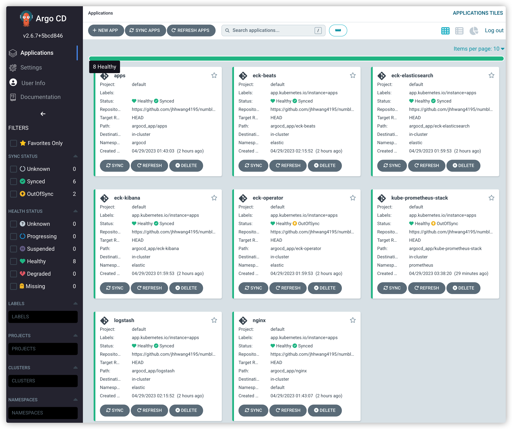

# numble-k8s-monitoring

쿠버네티스 모니터링 시스템을 구축합니다.

### 가이드라인
* [가이드라인](https://docs.google.com/presentation/d/1oIq8x9Zw1TmsniOBOnBwtmX0oV8eXvQGLnZjQPULapw/edit#slide=id.p)

### 쿠버네티스 모니터링
* GitOps를 위한 ArgoCD 설치
* 로그 모니터링: Elastic Search, Kibana, LogStash, Filebeat
* 지표 모니터링: Prometheus, Grafana
* ArgoCD app of apps pattern 활용

### 화면 캡쳐
* [part1-kubernetes](https://github.com/jhhwang4195/numble-k8s-monitoring/tree/main/images/part1)
* [part2-ArgoCD](https://github.com/jhhwang4195/numble-k8s-monitoring/tree/main/images/part2)
* [part3-로그 모니터링](https://github.com/jhhwang4195/numble-k8s-monitoring/tree/main/images/part3)
